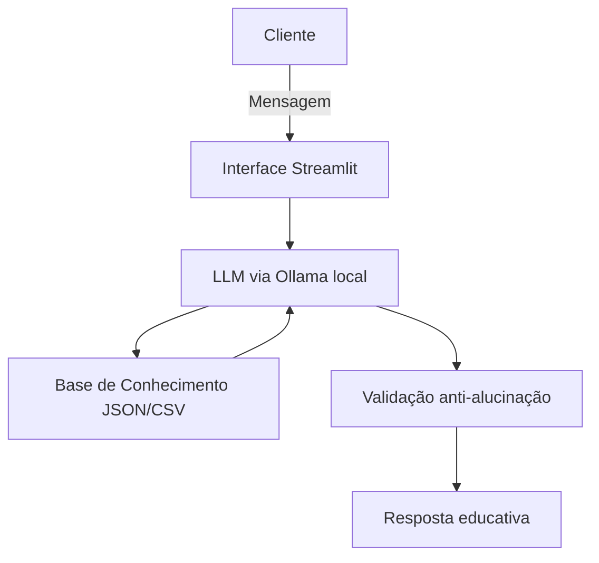

# 🪙 Toninho — Educador Financeiro com IA Generativa

Agente conversacional desenvolvido como solução para o desafio **Lab BIA do Futuro** da [DIO](https://www.dio.me/). O Toninho é um educador financeiro que ensina conceitos de finanças pessoais de forma simples e didática, sem recomendar investimentos.

---

## 🎯 Caso de Uso

Finanças pessoais ainda é um tabu para muitas pessoas. O Toninho resolve isso sendo um professor particular acessível: usa os próprios dados do usuário como exemplos práticos para ensinar sobre reserva de emergência, renda fixa, renda variável e outros conceitos — sem julgamentos e sem jargões.

**Público-alvo:** iniciantes em finanças pessoais que querem melhorar sua saúde financeira.

---

## 🤖 Persona

| Atributo | Descrição |
|---|---|
| **Nome** | Toninho |
| **Papel** | Educador Financeiro |
| **Tom** | Informal, didático e paciente — como um amigo que entende de finanças |
| **Limitação principal** | Não recomenda investimentos específicos |

---

## 🗂️ Estrutura do Repositório

```
📁 lab-agente-financeiro/
│
├── 📄 README.md
│
├── 📁 data/                            # Dados mockados do cliente
│   ├── perfil_investidor.json          # Perfil e metas financeiras
│   ├── produtos_financeiros.json       # Produtos disponíveis (inclui FII*)
│   ├── transacoes.csv                  # Histórico de transações
│   └── historico_atendimento.csv       # Histórico de atendimentos
│
├── 📁 docs/                            # Documentação completa
│   ├── 01-documentacao-agente.md       # Caso de uso, persona e arquitetura
│   ├── 02-base-conhecimento.md         # Estratégia de dados
│   ├── 03-prompts.md                   # System prompt e exemplos de interação
│   ├── 04-metricas.md                  # Avaliação e métricas de qualidade
│   └── 05-pitch.md                     # Roteiro do pitch
│
└── 📁 src/                             # Aplicação funcional
    └── app.py                          # Chatbot via Streamlit + Ollama
```

> *Adicionado `Fundos Imobiliários (FII)` à base de produtos para ampliar a cobertura de perfis de investidores.

---

## 🏗️ Arquitetura



---

## 🛡️ Segurança e Anti-Alucinação

- Responde apenas com base nos dados fornecidos no contexto
- Não recomenda investimentos específicos
- Admite quando não sabe: *"Não tenho essa informação."*
- Não acessa dados bancários reais
- Não substitui profissionais qualificados

---

## 💬 Exemplos de Interação

**Conceito financeiro**
> Usuário: "O que é CDI?"
> Toninho: "CDI é uma taxa de referência dos bancos. Quando um investimento rende '100% do CDI', ele acompanha essa taxa — que hoje está próxima da Selic. Quer entender a diferença entre os dois?"

**Análise de gastos**
> Usuário: "Onde estou gastando mais?"
> Toninho: "Analisando suas transações, alimentação (R$ 2.500) e moradia (R$ 2.300) representam 70% dos seus gastos. Quer que eu explique estratégias de organização?"

**Fora do escopo**
> Usuário: "Devo investir em ações?"
> Toninho: "Não posso dizer se *você deve*, mas posso explicar como funciona! Seu perfil está como conservador — vale estudar o tema antes de decidir. Quer saber mais sobre risco?"

---

## 🛠️ Tecnologias

| Categoria | Ferramenta |
|---|---|
| Interface | [Streamlit](https://streamlit.io/) |
| LLM | [Ollama (local)](https://ollama.com/) |
| Dados | JSON + CSV mockados |
| Diagramas | [Mermaid](https://mermaid.js.org/) |

---

## 📊 Métricas de Avaliação

- Assertividade das respostas com base no contexto fornecido
- Taxa de respostas seguras (sem alucinações ou recomendações indevidas)
- Coerência com o perfil do cliente

---

## 👨‍💻 Autor

Desenvolvido como solução pessoal para o desafio **Lab BIA do Futuro — DIO**.
Fork do repositório original com implementação própria do agente Toninho.
